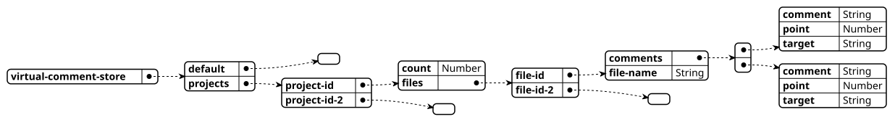

#+startup:    content indent

* overview, design
because parsing the text file is tedious store in elisp format and have a
special mode to read it and show it in a buffer.

persistent file is project based or global

must have something like project based management mechanism to share 

such as tide.

when a buffer with icl mode on started up it will locate its project root which resolves
to global or project root. The project root is now a unique key to indentify the comment store

there is a global comment store which is a map of project  root -> project comment store

project comment store:
- comments: (file (line . comment)...)
- count: number of active buffers reading this store, when is is down to zero comments will be set to nil
- hook: this hook runs on store changed

** use case:
in project A, buffer a starts up and gets its project unique key as A,
From the global comment stores it gets it project comment store.
It is nil and the count is now set to 0.
With the count value it knows that it is the first one to access this store. 
It updates the count to one and initializes comments value for project.
Then it reads the comments from the store and show the comments in buffers.

Next a buffer b in project A starts up, and follows the same procedure but the
count is already greater than 0 so it means the project comment store is
already set up to go. So buffer b will just use the store and increase the count.

Some time later buffer b closes, it will decrease the count. It check the count
is still greater than 0

And finally buffer a is about to close. After decreasing the count to 0, that
means it is the last consumer of the store so it set the comment variable to
nil. Persist the data to a .ilc file

No memory leak this way.

how buffer updates data
** occur mode add marker info to text 
(get-text-property (point) 'occur-target)

use propertize to make string
* DONE test setup
CLOSED: [2020-12-05 Sat 11:44]
cask install
cask exec ert-runner

* data stucture for project
hash table
project: file -> comments { line: comment } 
#+begin_src elisp
((#<overlay from 8503 to 8503 in ipa.el> .
            #("need to forward-char here" 0 25
              (fontified nil)))
 (#<overlay from 22765 to 22765 in ipa.el> .
            #("use project
multiple line really" 0 11
(fontified nil)
12 32
(fontified nil)))
 (#<overlay from 23192 to 23192 in ipa.el> .
            #("take care of project option" 0 27
              (fontified nil))))
#+end_src

https://github.com/sigma/pcache
** virtual-comment-store: singleton
*** default: virtual-comment-project 
*** projects: {project-id: virtual-comment-project} 
- project-id: md5
**** virtual-comment-project 
***** count: Number
***** files: {filename: virtual-comment-buffer-data}
****** virtual-comment-buffer-data
******* filename
******* comments: [virtual-comment-unit]
******** virtual-comment-unit
********* point
********* comment
********* target
** uml
#+begin_src plantuml :file media/data.svg
@startjson
{
   "virtual-comment-store" : {
      "default" : {},
      "projects" : {
         "project-id" : {
            "count" : "Number",
            "files" : {
               "file-id" : {
                  "comments" : [
                     {
                        "comment" : "String",
                        "point" : "Number",
                        "target" : "String"
                     },
                     {
                        "comment" : "String",
                        "point" : "Number",
                        "target" : "String"
                     }
                  ],
                  "file-name" : "String"
               },
               "file-id-2" : []
            }
         },
         "project-id-2" : {}
      }
   }
}
@endjson
#+end_src

#+RESULTS:

* overlay structure
(overlay-put (make-overlay (point) (point) (current-buffer)) 'before-string "crap")

(overlay-put (make-overlay (point) (point) (current-buffer)) 'before-string "crap")
* problem with overlay moving
if only data structure is kept i.e line number and string
then when overlay is moved because of buffer change then we lose track of overlay

overlay should stick to the line it belongs to, eg symbol-overlay

in buffer 

we don't manage the ov list anymore sorting it keep it in order is a headache
just grab all the overlays in the buffer which has the tag then this is it.

https://www.gnu.org/software/emacs/manual/html_node/elisp/Finding-Overlays.html

for next and previous
next-overlay-change pos
previous-overlay-change pos
* CANCELED merge comments when the lines they are on are joined into one line
* DONE next and previous comment
* DONE indentation comment
how to extract and make/separate comment from indentation
the real string stored in 'virtual-comment tag
'before-string is to store the presentational text
* handle comment when its line moves is a big headache
there is a hook but it won't get triggered on some occasions so we won't handle
it. instead we provide functions to repair, copy and paste comment

yank, paste
* data layer
** function that grabs all the current overlays in buffer
** function that takes overlays list and produces comment data structure

read-from-string is a built-in function in ‘C source code’.

(read-from-string STRING &optional START END)

Read one Lisp expression which is represented as text by STRING.
Returns a cons: (OBJECT-READ . FINAL-STRING-INDEX).
FINAL-STRING-INDEX is an integer giving the position of the next
remaining character in STRING.  START and END optionally delimit
a substring of STRING from which to read;  they default to 0 and
(length STRING) respectively.  Negative values are counted from
the end of STRING.
** dump dat to file and load
it's a experiment
* repair should take into account of indentation beside point-at-bol
* unused sorting
#+begin_src elisp
(defun virtual-comment-buffer-overlays--add (ov my-list)
  "MY-LIST has at least one element and its head is smaller than OV."
  (let ((start (overlay-start ov))
        (head (car my-list))
        (tail (cdr my-list)))
    (if (or (not tail)
            (<= start (overlay-start (car tail))))
        (setcdr my-list (cons ov tail))
      (virtual-comment-buffer-overlays--add ov tail))))

(defun virtual-comment-buffer-overlays-add (ov)
  "Add OV to `virtual-comment-buffer-overlays' in order."
  (if (or (not virtual-comment-buffer-overlays)
          (< (overlay-start ov) (overlay-start (car virtual-comment-buffer-overlays))))
      (push ov virtual-comment-buffer-overlays)
    (virtual-comment-buffer-overlays--add ov virtual-comment-buffer-overlays)))

#+end_src

* TODO a timer to update buffer data when idle
tbd
run-with-idle-timer
https://www.gnu.org/software/emacs/manual/html_node/elisp/Idle-Timers.html

virtual-comment--update-async
functions that needs to call this 
yank
make
paste
realign
should we make it as a hook
* DONE clear all on mode disabled
* mode to show commnents in buffer and projects
- show list of commnents of current buffer
- show list of files with comments of projects
- jump to place

based on outline mode or occur mode
how about org mode, outline mode lacks some commands

org mode is the best but unable to bind RET key when evil is on
so use outline mode instead
* how to open buffer with file path and point
from helm-ag
it's find-file
* keymap action on line
http://ergoemacs.org/emacs/elisp_text_properties.html
* TODO handle overlays when their point is out of range
* DONE sort buffer data 
* DONE BUG file-name is nil and put in into project
how come? was that because of async?
probably the async get runs on and buffers that it doesn't belong to
* DONE hook on save should only run when there is a time scheduled
timer flag can tell if the update should do or not
* DONE some persistent and store access should only work when mode is on
delete
make
paste
align
* DONE quit-window command for show 
make a show mode so its keybindings can be reset by evil
local-set-key applies everywhere to major mode anywhere, not recommended
it applies to outline mode, it will apply to org mode because org mode
is based on outline mode.

* enable
#+begin_src elisp
(add-hook 'find-file-hook 'virtual-comment-mode)
(add-hook 'virtual-comment-show-mode 'outline-minor-mode)

(evilified-state-evilify virtual-comment-show-mode virtual-comment-show-mode-map
  "q" quit-window)

(spacemacs/declare-prefix "cv" "virtual-comments")
(spacemacs/set-leader-keys
  "cvv" #'virtual-comment-make
  "cvd" #'virtual-comment-delete
  "cvs" #'virtual-comment-show
  "cvj" #'virtual-comment-next
  "cvn" #'virtual-comment-next
  "cvN" #'virtual-comment-previous
  "cvk" #'virtual-comment-previous
  "cvp" #'virtual-comment-paste
  "cvr" #'virtual-comment-realign)
#+end_src

* TODO comments won't get saved when emacs closed or restarted
unconfirmed
* DONE comments scattered away or lost when buffer changed not by user's input but by revert-buffer
revert-buffer does it work like we open the file again?
it is seems to be the case

revert-buffer default option will reload all mode
but auto-revert-buffer won't. it keeps current modes

we need to handle after-revert-buffer-hook

but we can't tell hard and soft reload apart. Yes we set the flag
virtual-comment--is-initialized 
* TODO we can't do anything to undo
when undo applies to region having comments, we lose them

* TODO use notify to listen to change in evc file
+ [x] we only persist to project .evc when the last buffer closed

+ [x] must have a function to replace active data with data loaded from store
  - first call virtual-comment--reload-project once for the project
  - next each buffer calls virtual-comment--reload-data

+ [ ] get all buffers belonging to the project and run the init again in a
  with-current-buffer. This way alleviates the doubled pubsub between buffers
  and store

* DONE tie comment with line content
(point comment target)

and then before any update or a timer we run a function to reconcile any
mismatch between point and line-content then find the right line and move the ov
to it

(thing-at-point 'line t)

ov has virtual-comment virtual-comment-target

virtual-comment--ovs-to-cmts could be the place to reconcile the change

* TODO [ovwl] now line is tied to ov comment should ov cover the whole line?
and a notification inside ov can be added and the ov can self correct when there
is change inside it and update its position and its virtual properties

if so we don't need the reconcile process anymore
* DONE must decide where is the source of truth of 'virtual-comment-target
line at point or overlay
where do we assign the point value that's where we pick up the target
but point can be moved but target can be fixed on created
+ point can be moved freely
+ target should be fixed
+ [x] target created by -make
+ [x] target can be changed by -paste
+ [x] target can be changed by repair fn

* how to reconcile
org-open-at-point which calls org-link-open-as-file
finally (org-link-search "/When/")

         (words (split-string s)))
         (s-multi-re (mapconcat #'regexp-quote words "\\(?:[ \t\n]+\\)"))
         
         ((catch :fuzzy-match
        (goto-char (point-min))
        (while (re-search-forward s-multi-re nil t)
          ;; Skip match if it contains AVOID-POS or it is included in
          ;; a link with a description but outside the description.
          (unless (or (and avoid-pos
                           (<= (match-beginning 0) avoid-pos)
                           (> (match-end 0) avoid-pos))
                      (and (save-match-data
                             (org-in-regexp org-link-bracket-re))
                           (match-beginning 3)
                           (or (> (match-beginning 3) (point))
                               (<= (match-end 3) (point)))
                           (org-element-lineage
                            (save-match-data (org-element-context))
                            '(link) t)))
            (goto-char (match-beginning 0))
            (setq type 'fuzzy)
            (throw :fuzzy-match t)))
        nil))
[[file:virtual-comment.el::unless (string= org-target current-target]]

* overlays-in vs overlays-at
this is a headache
for (virtual-comment--get-overlay-at point)
we use (overlays-at point) to get all overlays but this function can't
get empty overlays. (overlays-in point point) can get the empty overlays
but then it can't get overlays when at the beginning of the overlay start

we may risk to use save-excursion to check for empty line which is not clean.
fix is (overlays-in point (1+ point)), may need to consider the point-max
* before emacs is killed, persistence won't kick it
it seems that kill-buffer-hook is not triggered in this case

insprired by flycheck-global-teardown we would do the same
add have a function to kill buffer hook
this function will go through the buffer list if mode is active
it will call 

* DONE ref/location feature
CLOSED: [2021-09-27 Mon 23:02]
a function to produce this string: symbol | project-file-path:line-number
a function to get read the string and extract project-file-path:line-number then allows us to go there

how can we add the string to the comment? we store the string in a list ((string . project)) then we invoke a function to append the string to the comment

* DONE Issue with multiple frame for emacs 28
on emacs 28 read-from-minibuffer will be unable to focus to the prompt on first
try if the prompt or the initial text has new line character.
(read-from-minibuffer "what: \n")

this is because emacs 28 has a new behavior for minibuffer

#+begin_quote
Improved handling of minibuffers on switching frames.
By default, when you switch to another frame, an active minibuffer now
moves to the newly selected frame.  Nevertheless, the effect of what
you type in the minibuffer happens in the frame where the minibuffer
was first activated.  An alternative behavior is available by
customizing 'minibuffer-follows-selected-frame' to nil.  Here, the
minibuffer stays in the frame where you first opened it, and you must
switch back to this frame to continue or abort its command.  The old
behavior, which mixed these two, can be approximated by customizing
'minibuffer-follows-selected-frame' to a value which is neither nil
nor t.
#+end_quote

The old behavior is desired
(setq minibuffer-follows-selected-frame nil)

probably need to move away from minibuffer to prompt for a block of text
string-edit and phantom-inline-comment are examples
** create buffer
run a callback
* DONE delete comments from  evcs
on evcs buffer get the  virtual-comment-unit at point

remove it from virtual-comment-buffer-data 

delete the the comment and the target line in the buffer

check if the target buffer is open. If so trigger update on that buffer

default case when handle non project files
* TODO handle string-p is nil when strayed comments are stacked on top 
* TODO prevent data loss
the best way is to have evc data per git branch: =.ecv.branh-name=
but it would be tedious how to transfer common data accross branch

** DONE a simple solution is to create a backup file every time we persist
** never delete strayed comments
if we can't place them then put them in a lost and found place
** DONE only save when data is changed
solution: diff data and validate saved data

how to tell if data is changed?
- when you add a comment then mark a flag
- but comments can be moved a round without user action due to file changes

what now?
- each comment emit and event on change? too complicated
- can we diff the project data? yes we can
- before persist data we diff the data if they are different then back up and save otherwise do nothing
*** diff data
https://stackoverflow.com/questions/18180393/compare-hash-table-in-emacs-lisp

#+begin_example elisp
(defun hash-equal (hash1 hash2)
  "Compare two hash tables to see whether they are equal."
  (and (= (hash-table-count hash1)
          (hash-table-count hash2))
       (catch 'flag (maphash (lambda (x y)
                               (or (equal (gethash x hash2) y)
                                   (throw 'flag nil)))
                             hash1)
              (throw 'flag t))))
#+end_example
* DONE relocate comments via surrounding context instead of guessing
CLOSED: [2026-09-20 Sun]
extends "handle comment when its line moves is a big headache" above, and
is the fix for "never delete strayed comments" and part of "prevent data
loss": the old repair function (virtual-comment--repair-overlay-maybe)
only ever searched for the *first* fuzzy match of target in the whole
buffer, and if nothing matched at all it still silently accepted whatever
text happened to be at the stale point as correct. two concrete problems
came from that:
- target matching more than one line (}, return nil, blank lines...)
  always snapped to whichever occurrence came first, not the one nearest
  where the comment actually was
- if target no longer existed anywhere (line edited or deleted), repair
  had no way to say so, it just pretended the current wrong line was
  right, so wrong locations spread quietly and nobody could tell

(a first pass at this also tried using git history, walking a recorded
commit/line forward through `git diff' hunks when text alone couldn't
decide. dropped it before merging, too heavy-handed for what it bought:
a whole diff-hunk parser and a new external-process dependency just to
help the rare case where context lines don't already disambiguate. text
+ context covers the common cases fine on its own.)

** design
each virtual-comment-unit now carries a small fingerprint instead of just
target:
- above-target, below-target: the lines that used to border target, used
  to disambiguate it when it matches more than one place
- unanchored: t when the last repair could only guess, or found nothing

resolution in virtual-comment--resolve-target (currently just a thin
wrapper around virtual-comment--resolve-target-via-text, kept as its own
entry point in case another strategy is worth adding later):
fuzzy-match target against the whole buffer (virtual-comment--search-all,
no longer stopping at the first hit)
- exactly one match, use it
- more than one, filter to whichever also has matching above/below
  neighbors (virtual-comment--neighbor-line-matches-p)
- still ambiguous, fall back to whichever match sits closest to the
  comment's last known position (virtual-comment--closest-point), and
  flag it unanchored
- no match anywhere, leave the overlay exactly where it was (do not
  silently drift) and flag it unanchored

only a confident resolution (unique or context) is allowed to overwrite
the stored fingerprint. a nearest guess moves the overlay for display but
keeps the old fingerprint intact, so a later repair with better
information can still recover the real spot instead of compounding a
wrong guess.

unanchored comments get virtual-comment-unanchored-face on the overlay
and an [UNANCHORED] marker in virtual-comment-show, instead of being
silently right or silently wrong with no way to tell which.

** gotcha found along the way: struct is read back positionally
cl-defstruct records print/read positionally
(#s(virtual-comment-unit 1 "hi" "line"), not by slot name), so adding
these fields would break reading an old .evc the moment a new slot's
accessor got called (args-out-of-range). virtual-comment-unit--upgrade
pads an old, shorter record to the current shape on load
(virtual-comment--upgrade-persisted-data). worth remembering for any
future struct field addition, not just this one.

** known limitations / not done here
- still just text-based: a line that was itself edited (not moved) will
  usually show up as "not found" rather than "found, but changed" -
  revisit git-based history matching later if this turns out to matter
  in practice, scoped down (e.g. only for the exact commit boundary
  case) rather than the general hunk-walking version that got cut here
- doesn't touch "use notify to listen to change in evc file" above, that
  is about the .evc file itself changing under us (a teammate's git
  pull racing our own save), a different problem from a single comment's
  line moving inside a file we already have open

* DONE store .evc as a plain, sorted, pretty-printed alist (like bookmark.el)
CLOSED: [2026-09-20 Sun]
prompted by looking at how Emacs's own bookmark.el persists itself: one
pretty-printed alist per bookmark, human readable and mergeable. .evc was
a single prin1'd hash-table of `virtual-comment-buffer-data' structs, each
holding a list of `virtual-comment-unit' structs, all as one unbroken
line with no internal structure a text-based tool (git diff/merge, human
eyes) could use. two consequences:
- unreadable/unhand-editable, one giant blob
- any two independent changes to the same .evc conflict on every merge,
  no exceptions, since the whole file is one line as far as line-based
  diff is concerned. confirmed this empirically: same two-branch add-a-
  comment-to-a-different-file scenario, old format conflicts 100% of the
  time, new format merges cleanly whenever the changed files don't sort
  alphabetically adjacent (adjacent insertions can still conflict, but
  cleanly, as ordinary resolvable text, not mangled printer syntax)

** design
only the disk boundary changed, nothing else in the file. all the
existing struct-based code (every accessor, all the repair/resolve
logic) is untouched, still works purely with
virtual-comment-unit/virtual-comment-buffer-data structs in memory. the
new pieces sit only between that and disk:
- virtual-comment--unit-to-alist / --alist-to-unit: one comment's struct
  <-> a small alist (point, comment, target, above-target, below-target,
  unanchored), by key not by position
- virtual-comment--buffer-data-to-entry / --entry-to-buffer-data: one
  file's buffer-data <-> (filename (comments alist...))
- virtual-comment--serialize-store / --deserialize-store: the whole
  files hash table <-> a list of entries, sorted by filename, comments
  within a file sorted by point. the sorting is load-bearing: without a
  deterministic order an unrelated change could reshuffle the whole file
  and manufacture conflicts that have nothing to do with what actually
  changed
- virtual-comment--dump-data-to-file now calls `pp' on that list instead
  of prin1 on the raw hash table
- virtual-comment--load-data-from-file branches on the shape of what it
  read: a list is the current format
  (virtual-comment--persisted-list-p), a hash-table is the old one
  (virtual-comment--persisted-data-p, same
  virtual-comment--upgrade-persisted-data path as before). no version
  marker needed, the two are just different lisp types

migration is transparent: an old file loads through the existing
upgrade path exactly as before, and gets rewritten in the new format
the next time that project's data is saved, which already happens on
its own. virtual-comment-unit--upgrade doesn't go away, it's just
legacy-only now, for files nobody has re-saved since this change.

the alist format also quietly finishes the job that upgrade function
was built for: a struct field added *after this point* needs no upgrade
step at all, ever, for data saved in the new format. missing key ->
alist-get returns nil -> same as a freshly created unit. confirmed by
hand-writing a .evc with a field this code has never heard of and
loading it without error.

** known limitation
sorting only makes concurrent edits to *different* parts of the list
merge cleanly. two comments added to the same file, or to two files that
happen to sort alphabetically adjacent, can still conflict - same
trade-off bookmark.el's own format has. real improvement over "always
conflicts", not a promise of "never conflicts".
